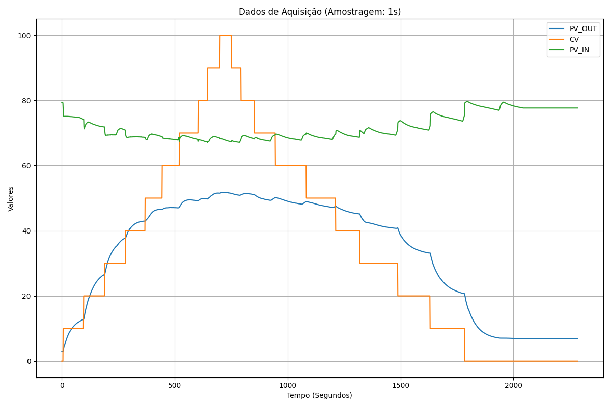
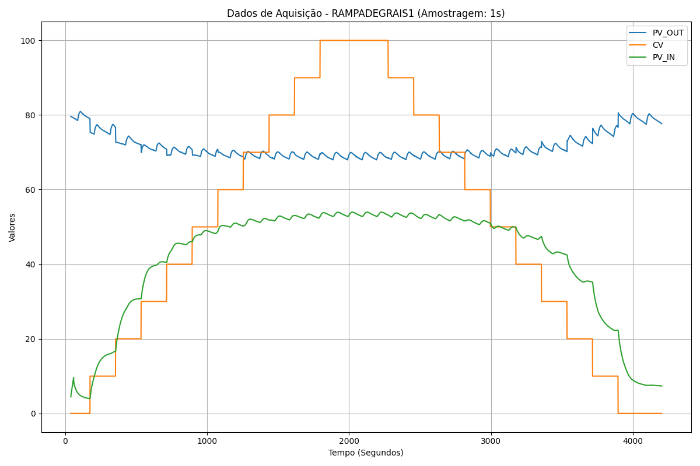

# Relatório de Aquisição - Planta de Pressão

Este documento apresenta o conjunto de dados coletados e processados para a etapa de criação e validação do modelo de redes neurais NARX (Nonlinear Autoregressive Exogenous Model). O processamento inicial consistiu na padronização temporal (amostragem ajustada para intervalos de 1 segundo) e na higienização e formatação dos valores numéricos das variáveis envolvidas: **PV_IN**, **CV** e **PV_OUT**.

Abaixo estão apresentados os três ensaios principais realizados para o levantamento da dinâmica do sistema:

---

## 1. Teste de Steps Manual
Neste ensaio, verificamos o comportamento e a resposta do sistema diante de estímulos manuais aplicados na variável de controle (CV), que representa a posição da válvula (sendo 0 para totalmente fechada e 100 para totalmente aberta).
- **Arquivo de Dados:** [TESTE1_processed.csv](./data/TESTE1_processed.csv)

---

## 2. Rampa de Degraus
Este teste consiste em uma aplicação de degraus sequenciais e progressivos, permitindo observar como o processo atinge a estabilidade em diferentes patamares operacionais.
- **Arquivo de Dados:** [RAMPADEGRAIS1_processed.csv](./data/RAMPADEGRAIS1_processed.csv)

---

## 3. Curva Semi Estática
Este ensaio levanta a curva característica em regime semi-estático para mapear possíveis não linearidades na resposta ao longo de toda a faixa de operação do sistema.
- **Arquivo de Dados:** [SEMIESTÁTICA 1_processed.csv](./data/SEMIESTÁTICA%201_processed.csv)

